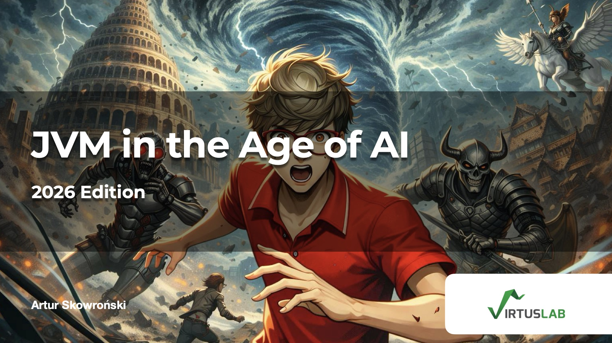

# Conference Talk: JVM in the Age of AI - 2026 Edition

## 📊 Presentation Slides

<div align="center">

<a href="https://github.com/ArturSkowronski/ArturSkowronski/blob/main/talks/media/11%20-%20JVM%20in%20the%20Age%20of%20AI%20-2026%20edition_compressed.pdf">
  
</a>

**[📥 View Full Presentation (PDF)](https://github.com/ArturSkowronski/ArturSkowronski/blob/main/talks/media/11%20-%20JVM%20in%20the%20Age%20of%20AI%20-2026%20edition_compressed.pdf)**

*JFokus 2026 - Stockholm, Sweden*

</div>

---

## Build Status

[](https://github.com/ArturSkowronski/conference-jvm-in-age-ai-2026/actions/workflows/tensorflow-ffm.yml)
[](https://github.com/ArturSkowronski/conference-jvm-in-age-ai-2026/actions/workflows/java-llama-cpp.yml)
[](https://github.com/ArturSkowronski/conference-jvm-in-age-ai-2026/actions/workflows/jcuda.yml)
[](https://github.com/ArturSkowronski/conference-jvm-in-age-ai-2026/actions/workflows/llama3-java.yml)
[](https://github.com/ArturSkowronski/conference-jvm-in-age-ai-2026/actions/workflows/valhalla.yml)
[](https://github.com/ArturSkowronski/conference-jvm-in-age-ai-2026/actions/workflows/tornadovm.yml)

**Just sanity checks for now**

[](https://github.com/ArturSkowronski/conference-jvm-in-age-ai-2026/actions/workflows/graalpy-demo.yml)
[](https://github.com/ArturSkowronski/conference-jvm-in-age-ai-2026/actions/workflows/babylon.yml)

This repository contains demos, benchmarks, and documentation from the "JVM in the Age of AI" conference talk (JFokus 2026). All demos are functional and can be run on your own hardware.

## Quick Start

```bash
# Run all smoke tests (quick validation)
./gradlew runSmokeTests

# Run all LLM inference runs
./gradlew runBenchmarks
```

## Demos

### LLM Inference Demos (M1 Pro / GPU Tesla T4 optimized, hueristics only)

All demos use the same model: Llama 3.2 1B Instruct (FP16, ~2.5 GB)

| Demo | Technology | Command |
|------|------------|---------|
| **java-llama.cpp** | JNI + Metal/CUDA GPU | `./gradlew :demos:java-llama-cpp:run` |
| **Cyfra** | Scala + Vulkan GPU | `./cyfra-demo/scripts/run-cyfra-llama.sh` |
| **Llama3.java** | Pure Java Vector API | `./gradlew :demos:llama3-java:run` |
| **GraalPy (CPython)** | Python (CPython) | `./gradlew :demos:graalpy:llamaPython` |
| **TornadoVM** | Java + OpenCL GPU | `./demos/tornadovm/scripts/run-gpullama3.sh` |
| **GraalPy (GraalPy)** | Python (GraalPy) | ❌ Fails | `./gradlew :demos:graalpy:llama` |

### GPU/Compute Demos

| Demo | Technology | Purpose | Command |
|------|------------|---------|---------|
| **TensorFlow FFM** | FFM API | TensorFlow C API from Java | `./gradlew :demos:tensorflow-ffm:run` |
| **JCuda** | JNI | CUDA device detection | `./gradlew :demos:jcuda:run` |
| **TornadoVM** | TaskGraph | GPU array operations | `./demos/tornadovm/scripts/run-tornado.sh` |
| **Babylon** | Code Reflection | HAT GPU MatMul | `./demos/babylon/run-babylon.sh` |
| **Valhalla** | Vector API | FP16 + SIMD operations | `./gradlew :demos:valhalla:run` |
| **Cyfra** | Scala/Vulkan | GPU programming | See cyfra-demo/ |

## Master Tasks

### Run All Smoke Tests (Quick Validation)

```bash
./gradlew runSmokeTests
```

**Runs:**
- TensorFlow FFM smoke test
- JCuda device detection
- Valhalla Vector API demos
- Babylon RuntimeCheck
- TornadoVM baseline
- GraalPy basic embedding

**Duration:** ~2-3 minutes

### Run All LLM Benchmarks

```bash
./gradlew runBenchmarks
```

**Runs:**
- Llama3.java (JDK 25)
- java-llama.cpp (Metal/CUDA)
- GraalPy CPython LLM
- GraalPy GraalPy LLM (fails - expected)

**Duration:** ~5-10 minutes (includes model loading)
**Requires:** Model at `~/.llama/models/Llama-3.2-1B-Instruct-f16.gguf`

## Setup

### Prerequisites

- **SDKMAN**: https://sdkman.io

### Install Java Environments

```bash
# From repository root
sdk env install && sdk env

# For each demo (optional - each has .sdkmanrc, they require different JDKs)
cd demos/<demo-name>
sdk env install && sdk env
```

### Download LLM Model

```bash
./scripts/download-models.sh --fp16
```

## Demo Structure

All Java demos follow consistent structure:

```
demos/<demo-name>/
├── src/main/java/com/skowronski/talk/jvmai/
│   └── *.java                   # Java sources
├── build.gradle.kts             # Gradle build
├── .sdkmanrc                    # JDK version
├── README.md                    # Quick start guide
└── Findings.md                  # Technical deep dive
```

**Package:** All Java demos use `com.skowronski.talk.jvmai`

## Individual Demo Quick Starts

### GraalPy - Python Embedding

```bash
# All 3 demos (basic, CPython LLM, GraalPy LLM)
./gradlew :demos:graalpy:run
```

### TensorFlow FFM - Foreign Function & Memory

```bash
./gradlew :demos:tensorflow-ffm:run
```

### java-llama.cpp - JNI Bindings

```bash
./gradlew :demos:java-llama-cpp:run
```

### JCuda - CUDA from Java

```bash
./gradlew :demos:jcuda:run
```

### Llama3.java - Pure Java LLM

```bash
# JDK 25 (fast - ~13 tok/s)
./gradlew :demos:llama3-java:run

# JDK 21 (slow - ~0.3 tok/s, 40x slower!)
./gradlew :demos:llama3-java:llama21
```

### Valhalla - Vector API + FP16

```bash
# Both Vector API and FP16 demos
./gradlew :demos:valhalla:run
```

### Babylon - Code Reflection + HAT

```bash
# RuntimeCheck + HAT MatMul (if Babylon JDK + HAT available)
./demos/babylon/run-babylon.sh

# RuntimeCheck only
./gradlew :demos:babylon:run
```

### TornadoVM - GPU Acceleration

```bash
# CPU baseline
./gradlew :demos:tornadovm:run

# GPU version (auto-downloads TornadoVM SDK)
./demos/tornadovm/scripts/run-tornado.sh
```

### Cyfra - Scala/Vulkan GPU

```bash
cd cyfra-demo
./scripts/run-cyfra-llama.sh --model ~/.llama/models/Llama-3.2-1B-Instruct-f16.gguf --prompt "Hello"
```

**Demo-specific findings:**
- **[demos/graalpy/Findings.md](demos/graalpy/Findings.md)** - GraalPy technical analysis and ctypes limitations
- **[demos/valhalla/FINDINGS.md](demos/valhalla/FINDINGS.md)** - Float16 and Vector API research
- **[demos/tensorflow-ffm/Findings.md](demos/tensorflow-ffm/Findings.md)** - FFM vs JNI analysis
- **[demos/java-llama-cpp/Findings.md](demos/java-llama-cpp/Findings.md)** - JNI performance deep dive
- **[demos/jcuda/Findings.md](demos/jcuda/Findings.md)** - JCuda vs alternatives
- **[demos/llama3-java/Findings.md](demos/llama3-java/Findings.md)** - Vector API 40x performance mystery
- **[demos/babylon/Findings.md](demos/babylon/Findings.md)** - Code Reflection and HAT
- **[demos/tornadovm/Findings.md](demos/tornadovm/Findings.md)** - TornadoVM technical analysis
